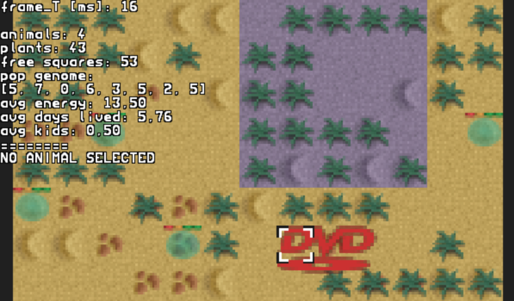
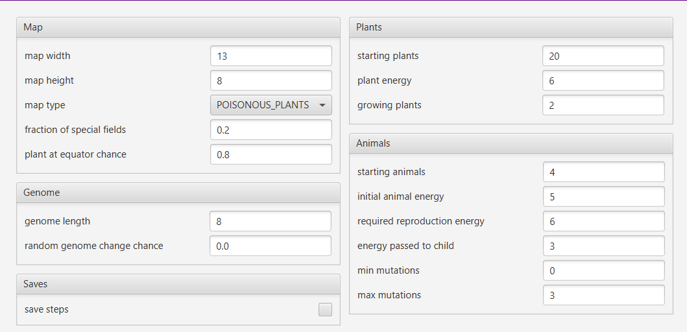

# Blob World




## TODO (description)

## Source code

### World
Authors: `Deaponn`, `szym-mie`

The `agh.ics.oop.model` package contains the vast array of world-related
classes. Every world that extends `AbstractWorldMap` is responsible for the
spawning logic via entity factories and interactions between entities. 

Each step works like this:
1. remove dead entities
2. move animal entities
3. sort animals based on animals comparator
4. eat plants
5. breed animals
6. grow plants
7. update animals state
8. emit map change event

Objects on the map are implementations of `WorldElement`, a minimal protocol 
for holding element position and checking equality. `WorldEntity` extends
it by adding direction of the entity. Entity and element implementations are
located in a different package however to not clutter the already busy `model`
package.

### Entities
Authors: `szym-mie`, `Deaponn`

Every object to be placed on the map is an entity, even `Ground` somewhat 
counter-intuitively. Entities must at least extend `WorldEntity` class. While 
this should be enough for static objects, living entities usually implement 
`EnergyHolder`, so that they can exchange energy points and interact with each 
other (eating/growing).

Notably, the design allow for entity factories, useful if you need to read 
configuration.

### Genome
Authors: `Deaponn`

One of the requirements for this project was to allow animals to evolve
by chance. While the genome does not influence any animal stats it at least
allows to see basic evolution.

### Simulation
Authors: `Deaponn`

To simulate multiple worlds at the same time, an approach with simulation
engine was taken advantage of. Both `Simulation` and `SimulationEngine` use
loop controllers under the hood, to prevent deadlocks, which were a significant
problem earlier. Simulations in general use `FixedDelayLoop` to schedule
updates, which talks to `ScheduledExecutorService`, to create workers.

### Renderer
Authors: `szym-mie`

Might be the most complex code structure in this project. There is a good
reason for that though - the renderer code is very loosely coupled to model
classes, in exchange for a relatively small performance cost.

Take the `Animal` class as an example. You would like to draw the animal
itself with a health bar on top. By extending `UnitRenderer<Animal>` and
overriding `render(WorldRenderer, ViewLayer, Animal)` render method, you
can then easily attach it to `Animal` class by annotating the class like this:
```java
@AssignRenderer(renderer = AnimalRenderer.class)
public class Animal extends WorldEntity implements EnergyHolder, Comparable<Animal> {
    // ...
}
```

Renderers are created dynamically, when you need to render an entity and are
reused for any future renders. Thus, you can load image samplers in a
constructor without worrying about performance implications.

#### Overlays

Overlays are different to entities, such that they cannot be placed in the 
world itself, instead functioning as a HUD element, with an arbitrary position
on the screen. There are a few abstract classes for text and images, which can
also implement their own "update on frame" logic.

#### Assignments

Because all assignments are done by annotating model classes, they need to be
resolved at runtime by mapping `Class<...>` to `UnitRenderer<...>`. Later, by 
also utilizing reflection, render methods can be invoked. The complete working
mechanism is however, somewhat more sophisticated, allowing for transparent
assignments for subclasses by default, and throughout error checking.

#### Rendering

Because of all the loose coupling, there are no restrictions for user-created
renderers, allowing for a very flexible drawing setup - end user can have as
any number of view layers, can assign them dynamically to the same element on
the fly, shuffle multiple image sampler maps, update/render different elements
at any time, reducing the number of redraws etc. This really made the 
difference, especially at the end of the project, where it allowed us to make
last-minute updates/fixes without the whole project going down.

### Exporter
Authors: `szym-mie`, `Deaponn`

Somewhat of an overkill, the `Exporter` interface is able to introspect class
fields, and only select ones annotated with `@Exported`. Such model is well
suited for list of instances to be exported to CSV files.

### Reactive
Authors: `szym-mie`

A minimal implementation of reactive values, while only supporting basic 
value/event propagation, yet it proved useful and sufficient for our purposes.

Instead of providing many different reactive types, there is only one class
`Reactive<V>`, greatly reducing the complexity of the interface. You are also
able to intuitively map values between reactive values, and emit events on
state changes. Moreover, you can specify propagation type for each bind - 
stoping forwarding to either reactive values or event listeners.

### View
Authors: `szym-mie`

Views are responsible for actually displaying image samplers, while managing
aspects such as transparency and state of display backend, in this case JavaFX.
The rendering model is based upon layer approach, meaning you can create
static background, dynamic foreground and a HUD layer easily and expand it as
needed.

In addition to rendering views gather all inputs and share them via `ViewInput`
class with reactive fields.

### Window
Authors: `szym-mie`

Windows hide and abstract away JavaFX functionality, allowing for a more page
based approach in which a new window receives bundle of data from launcher
window.
A window controller ties it all together, plus additional window logic and
launching new windows through custom methods.

### Dialog
Authors: `szym-mie`

Dialogs are well-supported and highly customizable by utilizing Mediator design
pattern, and overloaded with a lot of generic parameters. Each field has its
own field ID and communicates with custom `DialogMediator`. Each change to 
input is either passed or denied by a mediator, which then emits appropriate
event to all listeners. Creating a dialog is as simple as overriding method
`emitValue` on `DialogMediator`.

### Toast
Authors: `szym-mie`

Toasts mimic its Android counterpart, being as straightforward to use - you
just need to invoke `Window::showToast` method with a message and a specified
duration. 

### Configuration
Authors: `Deaponn`

Configuration takes care of validating fields and is serializable by builtin
Java mechanisms to XML. Interoperates closely with dialog mediator.
